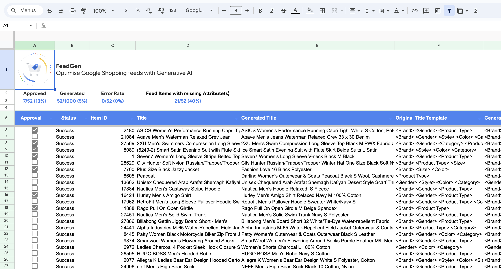

<!--
Copyright 2023 Google LLC

Licensed under the Apache License, Version 2.0 (the "License");
you may not use this file except in compliance with the License.
You may obtain a copy of the License at

      http://www.apache.org/licenses/LICENSE-2.0

Unless required by applicable law or agreed to in writing, software
distributed under the License is distributed on an "AS IS" BASIS,
WITHOUT WARRANTIES OR CONDITIONS OF ANY KIND, either express or implied.
See the License for the specific language governing permissions and
limitations under the License.
-->
<br>

# FeedGen: Optimise Shopping Ads feeds with Generative AI

[](https://github.com/google/feedgen/commits)
[](https://github.com/google/gts)

**Disclaimer: This is not an official Google product.**

[Overview](#overview) •
[What it solves](#challenges) •
[How it works](#solution-overview) •
[Get started](#get-started)

## Overview

**FeedGen** is an open-source tool that uses Google Cloud's state-of-the-art
Large Language Models (LLMs) to generate optimised Shopping Ads titles and
descriptions, and fill missing attributes in product feeds. It helps merchants
and advertisers surface and fix quality issues in their feeds using
Generative AI in a simple and configurable way.

The tool relies on GCP's Vertex AI API to provide both zero-shot and few-shot
inference capabilities on GCP's foundational LLMs. With
[few-shot prompting](https://cloud.google.com/vertex-ai/docs/generative-ai/text/text-overview),
you use the best 3-10 samples from your own Shopping Ads feeds to customise the
model's responses towards your own data, thus achieving higher quality and more
consistent output. This can be optimised further by fine-tuning the
foundational models with your own proprietary data. Find out how to fine-tune
models with Vertex AI, along with the benefits of doing so, at this
[guide](https://cloud.google.com/vertex-ai/docs/generative-ai/models/tune-models).

> Note: Vertex AI PaLM models
[currently only support English](https://cloud.google.com/vertex-ai/docs/generative-ai/learn/models#language_support).
For non-English language generation, please reach out to your Google Sales /
gTech representative to have the FeedGen team generate the output for you.

## Challenges

Optimising Shopping Ads feeds is a goal for every advertiser working with Google
Merchant Center (MC), as doing so would help improve query matching,
click-through rates (CTR), and conversions. However, it is cumbersome to sift
through product disapprovals in Merchant Center or manually fix quality issues.

FeedGen tackles this using Generative AI - allowing users to surface and fix
quality issues, and fill attribute gaps in their feeds in an automated fashion.

## Solution Overview

FeedGen is an Apps Script based application that runs as an HTML sidebar (see
[HtmlService](https://developers.google.com/apps-script/guides/html) for
details) in Google Sheets. The associated Google Sheets
[spreadsheet template](https://docs.google.com/spreadsheets/d/1L8cgQCppRwIOvNYR3kqelPuSfAYFhhLi8gvIcknnwNo/edit#gid=92939291)
is where all the magic happens; it holds the input feed that needs optimisation,
along with specific configuration values that control how content is generated.
The spreadsheet is also used for both (optional) human validation and setting up a
**supplemental feed** in Google Merchant Center (MC).

> Generative Language in Vertex AI, and in general, is an experimental feature /
technology. We highly recommend manually reviewing and verifying the generated
titles and descriptions. FeedGen helps users expedite this process by providing
a score between 0 and 1 (along with detailed score components) that represents
how "good" the generated content is, along with a Sheets-native way for
bulk-approving generated content via data filters.

First, make a copy of the [template spreadsheet](https://docs.google.com/spreadsheets/d/1L8cgQCppRwIOvNYR3kqelPuSfAYFhhLi8gvIcknnwNo/edit#gid=92939291) and follow the
instructions defined in the **Getting Started** section. The first step is for
users to authenticate to the Apps Script environment via the **Initialise**
button as shown below.


Afterwards, users should navigate to the **Config** worksheet to configure feed
settings, Vertex AI API settings as well as settings to control the content
generation.


All available data is used to generate descriptions, while titles use few-shot
prompting; a technique where users would select samples from their own input
feed as shown below to customise the model's responses towards their data. To
help with this process, FeedGen provides a utility Google Sheets formula:

```sql
=FEEDGEN_CREATE_JSON_CONTEXT_FOR_ITEM('Input Feed'!A2)
```

Which can be used to fill up the “Context” information field in the few-shot
prompt examples table by dragging it down, just as for other Sheets formulas.
Afterwards, users must manually fill in the remaining columns of the few-shot
prompt examples table, which define the expected output by the LLM. These
examples are very important as they provide the basis upon which the LLM will
learn how it should generate content for the rest of the input feed.


FeedGen defaults to using attributes from the input feed instead of generated
attribute values for composing the title, to avoid LLM hallucinations and ensure
consistency. For example, the value `Blue` from the input feed attribute
**Color** for a specific feed item will be used for its corresponding title
instead of, say, a generated value `Navy`. This behaviour can be overriden with
the `Prefer Generated Attributes over Input` checkbox in the
**Title Prompt Settings**, and is useful whenever the input feed itself contains
erroneous or poor quality data.

Now users are ready to optimise their feeds. Use the top navigation menu to
launch the FeedGen sidebar and start generating and validating content in the
**Generated Content Validation** worksheet.


Users would typically work within this view to approve / regenerate content for
each feed item as desired:

- Approval can be done in bulk via filtering the provided view and using the
  **Approve Filtered** button, or individually using the checkboxes in the
  Approval column.
- If an error occurs, it will be reflected in the **Status** column as "Failed".
- Clicking **Continue Generating** will first regenerate all columns with an
  *empty* or *failed* status before continuing on with the rest of the feed.
  For example, clearing row 7 above and clicking *Continue Generating* will
  start the generation process at row 7 first, before continuing on with the
  next feed item (53/1000).
  - This means that users may clear the value of the **Status** column for any
    feed item in order to *regenerate* it.



FeedGen provides a score for each feed item that may act as a quality indicator.
Let’s examine an entire row and walk through the individual components to
understand the scoring system:

- **Original Title**: 2XU Men's Swimmers Compression Long Sleeve Top
- **Generated Title**: 2XU Men's Swim Compression Long Sleeve Top Black M PWX
  Fabric UV Protection

First FeedGen extracts "features" of both the original and generated title in
order to compare them together. This is referred to as the **template** in our
ubiquitous language.

- **Original Title Template**: `<Brand> <Gender> <Category> <Product Type>`
- **Generated Title Template**: `<Brand> <Gender> <Category> <Product Type> <Color> <Size> <Material> <Highlights>`

We can directly see that 4 new attributes have been added. Great! But is that
really a good thing? Let’s dive deeper. The templates are compared to surface
the following points, which contribute either positively or negatively to the score:

1. Has the title changed? Yes!
1. Have attributes been added to the title? Yes! *Color*, *Size*, *Material* and
   *Highlights*.
1. Were there completely new words added that may have been *hallucinated* by
   the language model? Yes! The LLM added "UV Protection" which is not mentioned
   anywhere in the provided input feed. As a result the scoring system will
   incur a penalty for this behaviour. Examining the feed item more clearly
   however surfaces that the description indeed contained the value *UPF 50+*,
   so the addition of UV Protection is actually a *positive* thing, but since we
   have no way of assessing this (without applying a more granular semantic text
   analysis) we default to penalising the score.
1. Were there any feed **gap** attributes? In other words, did an attribute key
   (e.g. size) exist in the feed without a value, and FeedGen filled it up? Yes!
   The attribute **Color** is in the feed but missing. FeedGen inferred the
   value from the other feed input columns (in this case, **Description**) and
   filled it in. Great!
1. Were there any **newly added** attributes that did not previously exist in
   the feed? Yes! The **Highlights** attribute is entirely new and did not exist
   in the feed before. Completely new feed attributes will be prefixed with
  **new_** in the **Output Feed** (e.g. new_Highlights) and will be sorted to
  the end of the output sheet so that users can decide whether to include them
  or not.

|Score|Has the title changed?|Template changed?|New Words Added|Attributes Filled (gap)|Attributes Added|
|-|-|-|-|-|-|
|0.8|+0.2|+0.2|0|+0.2|+0.2|

Once you have completed all the necessary approvals and are satisfied with the
output, click **Export to Output Feed** to transfer all approved feed items
to the **Output Feed** worksheet.

The last step is to connect the spreadsheet to MC as a supplemental feed,
this can be done as described by this
[Help Center article](https://support.google.com/merchants/answer/7439058) for
standard MC accounts, and this
[Help Center article](https://support.google.com/merchants/answer/9651854)
for multi-client accounts (MCA).


Notice that there is a **custom_attribute_feedgen** column in the output feed.
This column name is completely flexible and can be changed directly in the
output worksheet. It adds a custom attribute to the supplemental feed for
reporting and performance measurement purposes.

### Best Practices

We recommend the following patterns for titles according to your business domain:

|Domain|Recommended title structure|Example|
|---|---|---|
|Apparel|Brand + Gender + Product Type + Attributes (Color, Size, Material)|Ann Taylor Women’s Sweater, Black (Size 6)|
|Consumable|Brand + Product Type + Attributes (Weight, Count)|TwinLab Mega CoQ10, 50 mg, 60 caps|
|Hard Goods|Brand + Product + Attributes (Size, Weight, Quantity)|Frontgate Wicker Patio Chair Set, Brown, 4-Piece|
|Electronics|Brand + Attribute + Product Type|Samsung 88” Smart LED TV with 4K 3D Curved Screen|
|Books|Title + Type + Format (Hardcover, eBook) + Author|1,000 Italian Recipe Cookbook, Hardcover by Michele Scicolone|

You can rely on these patterns to generate the few-shot prompting examples
defined in the FeedGen `Config` worksheet, which will accordingly steer the
values generated by the model.

We also suggest the following:

- Provide as many product attributes as possible for enriching **description** generation.
- Use **size**, **color**, and **gender / age group** for title generation, if available.
- Do **NOT** use model numbers or promotional text in titles.

### Vertex AI Pricing and Quotas

Please refer to the Vertex AI
[Pricing](https://cloud.google.com/vertex-ai/pricing#generative_ai_models) and
[Quotas and Limits](https://cloud.google.com/vertex-ai/docs/quotas#request_quotas)
guides for more information.

## Get Started

To get started with FeedGen:

1. Make a copy of the Google Sheets
[spreadsheet template](https://docs.google.com/spreadsheets/d/1L8cgQCppRwIOvNYR3kqelPuSfAYFhhLi8gvIcknnwNo/edit#gid=92939291)
1. Follow the instructions detailed in the `Getting Started` worksheet
