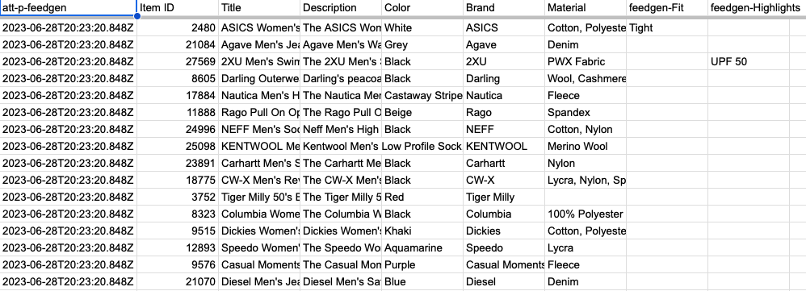

<!--
Copyright 2023 Google LLC

Licensed under the Apache License, Version 2.0 (the "License");
you may not use this file except in compliance with the License.
You may obtain a copy of the License at

      http://www.apache.org/licenses/LICENSE-2.0

Unless required by applicable law or agreed to in writing, software
distributed under the License is distributed on an "AS IS" BASIS,
WITHOUT WARRANTIES OR CONDITIONS OF ANY KIND, either express or implied.
See the License for the specific language governing permissions and
limitations under the License.
-->
<br>

# FeedGen: Optimise Shopping feeds with Generative AI

[](https://github.com/google/feedgen/commits)
[](https://github.com/google/gts)

**Disclaimer: This is not an official Google product.**

[Overview](#overview) •
[Get started](#get-started) •
[What it solves](#challenges) •
[How it works](#solution-overview) •
[How to Contribute](#how-to-contribute)

## Overview

**FeedGen** is an open-source tool that uses Google Cloud's state-of-the-art
Large Language Models (LLMs) to improve product titles, generate more
comprehensive descriptions, and fill missing attributes in product feeds. It
helps merchants and advertisers surface and fix quality issues in their feeds
using Generative AI in a simple and configurable way.

The tool relies on GCP's Vertex AI API to provide both zero-shot and few-shot
inference capabilities on GCP's foundational LLMs. With
[few-shot prompting](https://cloud.google.com/vertex-ai/docs/generative-ai/text/text-overview),
you use the best 3-10 samples from your own Shopping feed to customise the
model's responses towards your own data, thus achieving higher quality and more
consistent output. This can be optimised further by fine-tuning the
foundational models with your own proprietary data. Find out how to fine-tune
models with Vertex AI, along with the benefits of doing so, at this
[guide](https://cloud.google.com/vertex-ai/docs/generative-ai/models/tune-models).

> Note: Vertex AI PaLM models
[currently only support English](https://cloud.google.com/vertex-ai/docs/generative-ai/learn/models#language_support).
For non-English language generation, please reach out to your Google Sales /
gTech representative to have the FeedGen team generate the output for you.

## Get Started

To get started with FeedGen:

1. Make a copy of the Google Sheets
[spreadsheet template](https://docs.google.com/spreadsheets/d/19eKTJrbZaUfipAvL5ZQmq_hoxEbLQIlDqURKFJA2OBU/edit#gid=1661242997)
1. Follow the instructions detailed in the `Getting Started` worksheet

## Challenges

Optimising Shopping feeds is a goal for every advertiser working with Google
Merchant Center (MC) in order to improve query matching, increase coverage, and
ultimately click-through rates (CTR). However, it is cumbersome to sift
through product disapprovals in MC or manually fix quality issues.

FeedGen tackles this using Generative AI - allowing users to surface and fix
quality issues, and fill attribute gaps in their feeds, in an automated fashion.

## Solution Overview

FeedGen is an Apps Script based application that runs as an HTML sidebar (see
[HtmlService](https://developers.google.com/apps-script/guides/html) for
details) in Google Sheets. The associated Google Sheets spreadsheet template is
where all the magic happens; it holds the input feed that needs optimisation,
along with specific configuration values that control how content is generated.
The spreadsheet is also used for both (optional) human validation and setting up
a **supplemental feed** in Google Merchant Center (MC).

> Generative Language in Vertex AI, and in general, is an experimental feature /
technology. We highly recommend manually reviewing and verifying the generated
titles and descriptions. FeedGen helps users expedite this process by providing
a [score](#scoring--evaluation) between -1 and 1 (along with detailed components)
that represents how "good" the generated content is, along with a Sheets-native
way for bulk-approving generated content via data filters.

First, make a copy of the [template spreadsheet](https://docs.google.com/spreadsheets/d/1L8cgQCppRwIOvNYR3kqelPuSfAYFhhLi8gvIcknnwNo/edit#gid=92939291)
and follow the instructions defined in the **Getting Started** section. The
first step to authenticate to the Apps Script environment via the **Initialise**
button as shown below.


Afterwards, navigate to the **Config** worksheet to configure feed settings,
Vertex AI API settings, and settings to control the content generation.


All available data is used to generate descriptions, while titles use few-shot
prompting; a technique where one would select samples from their own input
feed as shown below to customise the model's responses towards their data. To
help with this process, FeedGen provides a utility Google Sheets formula:

```sql
=FEEDGEN_CREATE_CONTEXT_JSON('Input Feed'!A2)
```

Which can be used to fill up the “Context” information field in the few-shot
prompt examples table by dragging it down, just as for other Sheets formulas.
This "Context" represents the entire row of data from the input feed for this
item, and it will be sent as part of the prompt to the Vertex AI API.

Afterwards, you must manually fill in the remaining columns of the few-shot
prompt examples table, which define the expected output by the LLM. These
examples are very important as they provide the basis upon which the LLM will
learn how it should generate content for the rest of the input feed. The best
examples to pick are products where:

* You can identify attributes in the existing title that match *column names* from your input feed.
* You can propose a new title that is better than the existing one (e.g. contains more attributes).
* The proposed title has a structure that can be reused for other products within your feed.

We would recommend adding at least one example per unique category within your
feed, especially if the ideal title composition would differ.


FeedGen defaults to using attributes from the input feed instead of generated
attribute values for composing the title, to avoid LLM hallucinations and ensure
consistency. For example, the value `Blue` from the input feed attribute
**Color** for a specific feed item will be used for its corresponding title
instead of, say, a generated value `Navy`. This behaviour can be overridden with
the `Prefer Generated Values` checkbox in the **Advanced Settings** section of
the *Title Prompt Settings*, and is useful whenever the input feed itself
contains erroneous or poor quality data.

Within this same section you can also specify a list of attribute keys that
should not be used for composing the generated titles. Examples are attributes
like `Price` or `Promotion`, which should not be part of titles at all as per the
[Best Practices](#best-practices) outlined by MC. Additionally, you can specify
a list of *safe* words that can be output in generated titles even if they did
not exist beforehand in your feed. For example, you can add the word "Size" to
this list if you would like to prefix all values of the `Size` attribute with it
(i.e. "Size M" instead of "M").

Now you are done with the configuration and ready to optimise your feed. Use the
top navigation menu to launch the FeedGen sidebar and start generating and
validating content in the **Generated Content Validation** worksheet.


You would typically work within this view to understand, approve and/or
regenerate content for each feed item as follows:

* The **Generate** button controls the generation process, and will first
  regenerate all columns with an *empty* or *failed* status before continuing on
  with the rest of the feed. For example, clearing row 7 above and clicking
  *Generate* will start the generation process at row 7 first, before continuing
  on with the next feed item.
  * This means that you may clear the value of the **Status** column for any
    feed item in order to *regenerate* it.
  * To start from scratch, click **Clear Generated Data** first before
    *Generate*.
* If an error occurs, it will be reflected in the **Status** column as "Failed".
* Approval can be done in bulk via filtering the view and using the
  **Approve Filtered** button, or individually using the checkboxes in the
  **Approval** column. All entries with a score above 0 will already be
  pre-approved (read more about FeedGen's
  [Scoring / Evaluation](#scoring--evaluation) system below).
* Additional columns for titles and descriptions are grouped, so that you may
  expand the group you are interested in examining.

Once you have completed all the necessary approvals and are satisfied with the
output, click **Export to Output Feed** to transfer all approved feed items
to the **Output Feed** worksheet.



The last step is to connect the spreadsheet to MC as a supplemental feed,
this can be done as described by this
[Help Center article](https://support.google.com/merchants/answer/7439058) for
standard MC accounts, and this
[Help Center article](https://support.google.com/merchants/answer/9651854)
for multi-client accounts (MCA).

Notice that there is a **att-p-feedgen** column in the output feed.
This column name is completely flexible and can be changed directly in the
output worksheet. It adds a custom attribute to the supplemental feed for
reporting and performance measurement purposes.

### Scoring / Evaluation

FeedGen provides a score for generated titles between -1 and 1 that acts as a
quality indicator. Positive scores indicate varying degrees of good quality,
while negative scores represent uncertainty over the generated content.

Let's take a closer look with some fictitous examples:

* **Original Title**: 2XU Men's Swim Compression Long Sleeve Top
* **Original Description**: 2XU Men's Swim Compression Long Sleeve Top,
  lightweight, breathable PWX fabric, UPF 50+ protects you from the sun.
* **Generated Title**: 2XU Men's Swim Compression Long Sleeve Top Black Size M
  PWX Fabric UV Protection
* **Score**: -1
* Reasoning: New words, namely "UV Protection", were added that may have been
  *hallucinated* by the language model. Indeed, "UV Protection" is not
  explicitly mentioned anywhere in the input feed. Examining the feed item more
  clearly however surfaces that the description contains the value *UPF 50+*, so
  the addition of *UV Protection* is actually a *positive* thing, but since we
  have no way of assessing this (without applying a more granular semantic text
  analysis) we default to penalising the score.

Let's look at another example for the same product:

* **Original Title**: 2XU Men's Swim Compression Long Sleeve Top
* **Generated Title**: 2XU Men's Swim Compression Top Size M
* **Score**: -0.5
* Reasoning: Key information was removed from the title, namely "Long Sleeve",
  which describes the type of the product. FeedGen identifies this information
  by first examining the structure of titles via what we refer to as
  **templates** in our uniquitous language, before diving deeper and comparing
  the individual words that compose the titles. Let's check the templates for
  our example:
  * **Original Title Template**: `<Brand> <Gender> <Category> <Product Type>`
  * **Generated Title Template**: `<Brand> <Gender> <Category> <Product Type> <Size>`
  * As you can see no attributes were actually removed, but rather the
    components of the `Product Type` attribute changed in a worse way, hence the
    negative score.

> FeedGen is conservative in its scoring; it will assign a score of -0.5
  whenever *any* words get removed, even if those words were promotional phrases
  such as `get yours now` or `while stocks last`, which should not be part of
  titles as per the [Best Practices](#best-practices) outlined by Merchant
  Center (MC).

Alright, so what makes a good title? Let's look at another example:

* **Original Title**: 2XU Men's Swim Compression Long Sleeve Top
* **Generated Title**: 2XU Men's Swim Compression Long Sleeve Top Size M
* **Score**: 0.5
* Reasoning: Nothing was changed or lost in the original title, and we added a
  new attribute, "Size". If the product was being offered in different sizes,
  this new title would now be vital in preventing all feed items for the product
  from getting rejected by MC (due to their titles being duplicates).

Finally, what's the ideal case? Let's take a look at one last example:

* **Original Title**: 2XU Men's Swim Compression Long Sleeve Top
* **Input - Color**: *missing*
* **Generated Title**: 2XU Men's Swim Compression Long Sleeve Top Black Size M
* **Output - Color**: Black
* **Score**: 1
* Reasoning: This is the best possible scenario; we optimised the title and
  filled feed attribute gaps along the way, a score of 1 is definitely
  well-deserved.

So in summary, the scoring systems works as follows:

|Are there hallucinations?|Have we removed any words?|No change at all?|Have we optimised the title?|Did we fill in missing gaps or extract [new attributes](#feed-gaps-and-new-attributes)?|
|-|-|-|-|-|
|-1|-0.5|0|Add 0.5|Add 0.5|

FeedGen also applies some basic MC compliance checks, such as titles and
descriptions must not be longer than 150 and 5000 characters, respectively. If
the generated content fails these checks, the value
`Failed compliance checks` will be output in the **Status** column. As
mentioned above, FeedGen will attempt to regenerate `Failed` items first
whenever the **Generate** button is clicked.

### Feed Gaps and New Attributes

FeedGen does not just fill gaps in your feed, but might also create completely
**new** attributes that were not provided in the *Input Feed*. This is
controllable via the few-shot prompting examples in the *Config* sheet; by
providing "new" attributes that do not exist in the input within those examples,
FeedGen will attempt to *extract* values for those new attributes from other
values in the input feed. Let's take a look at an example:

|Original Title|Product Attributes in Original Title|Product Attributes in Generated Title|Generated Attribute Values|
|---|---|---|---|
|ASICS Women's Performance Running Capri Tight|Brand, Gender, Product Type| Brand, Gender, Product Type, **Fit**| ASICS, Women's Performance, Running Capri, Tight|

Notice here how the **Fit** attribute was extracted out of *Product Type*.
FeedGen would now attempt to do the same for all other products in the feed,
so for example it will extract the value `Relaxed` as *Fit* from the title
`Agave Men's Jeans Waterman Relaxed`. If you do not want those attributes to be
created, make sure you only use attributes that exist in the input feed for your
few-shot prompting examples. Furthermore, those completely new feed attributes
will be prefixed with **feedgen-** in the **Output Feed** (e.g. feedgen-Fit) and
will be sorted to the end of the sheet to make it easier for you to locate and
delete should you not want to use them.

### Best Practices

We recommend the following patterns for titles according to your business domain:

|Domain|Recommended title structure|Example|
|---|---|---|
|Apparel|Brand + Gender + Product Type + Attributes (Color, Size, Material)|Ann Taylor Women’s Sweater, Black (Size 6)|
|Consumable|Brand + Product Type + Attributes (Weight, Count)|TwinLab Mega CoQ10, 50 mg, 60 caps|
|Hard Goods|Brand + Product + Attributes (Size, Weight, Quantity)|Frontgate Wicker Patio Chair Set, Brown, 4-Piece|
|Electronics|Brand + Attribute + Product Type|Samsung 88” Smart LED TV with 4K 3D Curved Screen|
|Books|Title + Type + Format (Hardcover, eBook) + Author|1,000 Italian Recipe Cookbook, Hardcover by Michele Scicolone|

You can rely on these patterns to generate the few-shot prompting examples
defined in the FeedGen `Config` worksheet, which will accordingly steer the
values generated by the model.

We also suggest the following:

* Provide as many product attributes as possible for enriching **description** generation.
* Use **size**, **color**, and **gender / age group** for title generation, if available.
* Do **NOT** use model numbers or promotional text in titles.

### Vertex AI Pricing and Quotas

Please refer to the Vertex AI
[Pricing](https://cloud.google.com/vertex-ai/pricing#generative_ai_models) and
[Quotas and Limits](https://cloud.google.com/vertex-ai/docs/quotas#request_quotas)
guides for more information.

## How to Contribute

Beyond the information outlined in our [Contributing Guide](CONTRIBUTING.md),
you would need to follow these additional steps to build FeedGen locally:

1. Make sure your system has an up-to-date installation of
   [Node.js and npm](https://docs.npmjs.com/downloading-and-installing-node-js-and-npm).
1. Navigate to the directory where the FeedGen source code lives.
1. Run `npm install`.
1. Run `npx @google/aside init` and click through the prompts.
   * Input the Apps Script `Script ID` associated with your target Google Sheets
     spreadsheet. You can find out this value by clicking on
     `Extensions > Apps Script` in the top navigation menu of your target sheet,
     then navigating to `Project Settings` (the gear icon) in the resulting
     [Apps Script](https://script.google.com) view.
1. Run `npm run deploy` to build, test and deploy (via
   [clasp](https://github.com/google/clasp)) all code to the target spreadsheet
   / Apps Script project.
